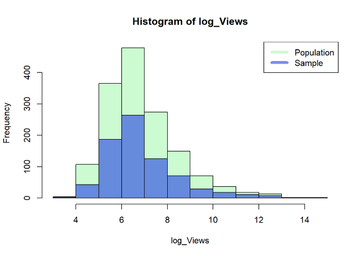
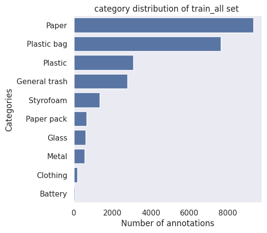
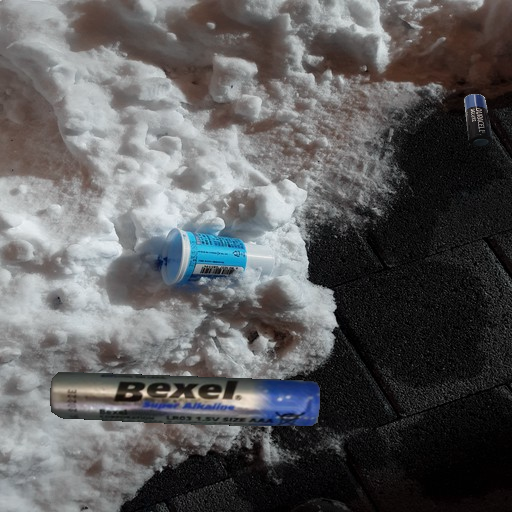

# Segmentation Wrapup Report

# 1. 프로젝트 개요

바야흐로 대량 생산, 대량 소비의 시대. 우리는 많은 물건이 대량으로 생산되고, 소비되는 시대를 살고 있습니다. 하지만 이러한 문화는 '쓰레기 대란', '매립지 부족'과 같은 여러 사회 문제를 낳고 있습니다.

분리수거는 이러한 환경 부담을 줄일 수 있는 방법 중 하나입니다. 잘 분리배출 된 쓰레기는 자원으로서 가치를 인정받아 재활용되지만, 잘못 분리배출 되면 그대로 폐기물로 분류되어 매립 또는 소각되기 때문입니다.

따라서 우리는 사진에서 쓰레기를 Segmentation하는 모델을 만들어 이러한 문제점을 해결해보고자 합니다. 문제 해결을 위한 데이터셋으로는 배경, 일반 쓰레기, 플라스틱, 종이, 유리 등 11 종류의 쓰레기가 찍힌 사진 데이터셋이 제공됩니다.

여러분에 의해 만들어진 우수한 성능의 모델은 쓰레기장에 설치되어 정확한 분리수거를 돕거나, 어린아이들의 분리수거 교육 등에 사용될 수 있을 것입니다. 부디 지구를 위기로부터 구해주세요! 🌎

- **Input :** 쓰레기 객체가 담긴 이미지가 모델의 인풋으로 사용됩니다. segmentation annotation은 COCO format으로 제공됩니다.
- **Output :** 모델은 pixel 좌표에 따라 카테고리 값을 리턴합니다. 이를 submission 양식에 맞게 csv 파일을 만들어 제출합니다.

---

# 2. 프로젝트 팀 구성 및 역할

김동영: Data and Inference Visualization, Pretrained Weight Search, Data Augmentation

김형훈: Validation set search, Training technique, Pseudo labeling

송영동: mmsegmentation외 다른 프레임웍 사용

정상헌: Model search, Copy-Paste Augmentation, 

최휘준: Model search, Training technique

---

# 3. 프로젝트 수행 과정 및 결과

## Ⅰ. 실험

## 1) Validation Set Search

### ① 아이디어 or 가설

베이스 라인으로 주어진 validation set의 mIoU와 제출 mIoU간의 격차가 많이 발생하였다. 
우리는 베이스 라인으로 주어진 validation의 기준을 정확히 알 수 없으므로 기존 train/validation dataset을 사용하지 않기로 하였다.

우리는 전체 모집단에서 train_all과 test를 샘플링 했을 것이며
따라서 train_all, test은 모집단 분포와 크게 벗어나지 않을 것이라는 가설을 세웠으며

class별로 mask의 사이즈가 유사하다는 관찰을 할 수 있었다.

우리는 이러한 가설과 관찰 결과로 StratifiedGroupKFold를 사용하여 class의 비율을 유지한 채로
train_all에서 train, validset을 split할 경우 신뢰도 높은 val set을 얻을 수 있을 것이라 생각하였다.

### ② 실험 설계

sklearn의 `StratifiedGroupKFold`을 사용하여 전체 데이터셋을 5fold로 나눈 뒤
각 fold에서 test mIoU와 갭이 가장 적은 validation set으로 앞으로의 실험을 진행하기로 하였다.
(모델 fcn_r50)

### ③ 실험 결과

| valid fold num. | best_epoch | mAcc | mIoU(valid) | 제출 mIoU | 성능 차이 |
| --- | --- | --- | --- | --- | --- |
| fold0 | 47 | 0.7285 | 0.6180 | 0.5430 | 0.0750 |
| fold1 | 44 | 0.6900 | 0.5830 | 0.5463 | 0.0367 |
| fold2  | 25 | 0.7216 | 0.5947 | 0.5401 | 0.0546 |
| fold3  | 27 | 0.6647 | 0.5621 | 0.5363 | 0.0258 |
| fold4 | 37 |  0.6896 | 0.5871 | 0.5573 | 0.0298 |

### ④ 결과 분석

validation mIoU는 0.56~0.61까지 넓은 분포를 이루고 있고, 
test mIoU는 0.53~0.55까지 분포를 이루고 있었다.

실험 결과 fold3 validation이 가장 test data와 유사하다고 판단하여 프로젝트를 진행하였다.

하지만, 일정 수준까지는 val mIoU와 test mIoU가 비례하였으나 일정 수준 이상(0.74)을 넘어서면
val mIoU로 test score와 상관 관계가 없어지는 것을 확인할 수 있었다.

cross validation을 이용하여 구하는 val mIoU가 제일 test mIoU와 비슷할 것으로 보이나,
cross validation을 이용하기에는 시간 소모가 너무 심하였다.

때문에 fold3로 모든 실험을 진행하기로 결정하였으며,
StratifiedGroupKFold가 아닌 segmentation에서 유효한 split 방법에 대해 공부의 필요성을 느꼈다.
(하지만 자료 검색이 잘 안된다…) 

---

## 2) Pretrain Weight Search

### ① 아이디어 or 가설

단순히 backbone의 pretrained weight만을 불러오는 것이 아닌, 어떠한 데이터셋으로 사전 학습된 모델의 전체(Decoder 등) weight를 불러와 학습 시킨다면 더욱 빠르고 좋은 수렴 결과에 도달할 수 있을 것이다. 또한, 사전 학습된 데이터셋의 성격에 따라서 그 정도가 다를 것이다.

### ② 실험 설계

사용 모델 : FCN-R101, HRNet-w48

각 사용된 모델마다 이외의 파라미터는 모두 동일

각기 다른 pretrained weight 들을 불러와 학습시키고 그 추이를 기록함.

### ③ 실험 결과

가설과 마찬가지로, 학습 초기 모델의 수렴 속도 및 결과에 유의미한 차이가 있었다.

### ④ 결과 분석

1. 성격이 비슷한 데이터셋에 대하여 학습된 모델 전체를 불러온다면, backbone의 weight 만 불러오는 것보다 좋은 효과를 기대할 수 있다.
2. 이번 프로젝트의 dataset과는 Pascal-Context dataset이 가장 비슷한 성격을 가지고 있으며, 따라서 해당 dataset으로 학습된 모델의 가중치를 가져오는 것이 유리하다.
3. Cityscapes dataset과 같이 기본 이미지 사이즈의 비율 자체가 다르고 성격이 상이한 dataset이라면, 오히려 해당 pretrained weight를 사용하지 않는 편이 바람직할 수 있다.

---

## 3) Model Search

### ① 아이디어 or 가설

UperNet_ConvNext실험을 통해 모델의 성능이 높을 수록 val mIoU가 높음을 확인 하였다.  이를 통해 ADE20K semantic segmentation 대회의 Paper mIoU 가 높은 모델이 우리의 데이터셋에서도 성능이 좋을 것이라는 가설을 세웠다. 따라서 Paper mIoU 기반으로 Model Search를 진행하였다.

### ② 실험 설계

1. MMSeg Config의 모든 모델 Paper mIoU 조사 
2. MMSeg 제공 모델을 Paper mIoU 높은 순서로 학습 & 제출
3. Paper with code 참고해서 SOTA 상위권 모델들도 학습 & 제출
    
    
    

### ③ 실험 결과

[Segmentor list (ADE20K) (1)](https://www.notion.so/6fd9a8d3671a46c3b8ea2aeb5a3718a4)

### ④ 결과 분석

- 대체적으로 paper mIoU 와 test mIoU가 양의 상관 관계를 이룬다.
- Mask2Former 모델이 우리의 SOTA 모델이다.
- backbone으로는 BEiT-Adapter의 성능이 가장 좋다.

---

## 4) Training Technique

### ① 아이디어 or 가설

upernet_beit_adapter의 좋은 성능(Papers with cod ADE20K rank10)이 우리 데이터 셋에서 재현이 되지 않았다.

우리는 upernet의 baseline lr이 2e-5에 wramup까지 default로 되어 있는 것을 확인하고 방향이 제대로 정해지지 않은 상태에서 초반에 큰 lr이 pretrain backbone(beit)을 망가트리는 것 같다는 가설을 세웠다.

### ② 실험 설계

우리는 대조군으로 모델 전체의 lr을 6e-05로 하여 학습을 진행하는 경우와

실험군으로는 백본에는 4e-6, 디코더에는 4e-5로 lr을 달리 적용하는 트레이닝 테크닉을 
적용하여 비교하였다.

| color | description |
| --- | --- |
| Red(비교군) | lr: 6e-5 |
| Blue(실험군) | backbone lr: 4e-6, decoder lr: 4e-5 |

### ③ 실험 결과

### ④ 결과 분석

실험 결과 bbone에는 작은 lr을 적용 시킨 모델이 초기 loss와 mIoU에서 큰 차이를 보여주었다.
엄격한 통제 변인으로 디코더에도 lr을 6e-5로 하지 못하여 정확한 A/B테스트를 하지 못하여 아쉬웠다.

우리는 이러한 성능의 이유를 self supervised 과정을 거친 pretrain beit 모델에서 
object boundary를 파악하는 능력이 있기에 우리가 가설로 세운 최대한 bbone을 학습을 최소화 하는 것이 성능 차이의 원인이 되었을 것이라 생각하나.

원인에 대해서는 조금 더 체계적이고 정확한 실험이 필요하다고 생각한다.

---

## 5) Data Augmentation - Style

### ① 아이디어 or 가설

컴퓨터 비전 task에서 모델의 성능을 끌어올리기 위해 입증된 방법인 data augmentation을 사용한다.

### ② 실험 설계

1. 데이터 증강을 하지 않은 채로 학습
2. Base augmentations (GuassNoise, RandomBrightnessContrast, HueSaturationValue)
3. Color augmentations (CLAHE, ColorJitter, HueSaturationValue)
4. RandomResizedCrop

### ③ 실험 결과

어떠한 종류의 augmentation를 사용했을 때에도 유의미한 성능 향상 효과가 없었다.

### ④ 결과 분석

본 컴페티션의 특성 상, 모델이 픽셀을 물체로 분류하는 데에 색상 정보를 많이 활용하고 있으며 그에 따라 픽셀의 RGB 값에 영향을 미치는 데이터 증강이 악영향을 미쳤을 것이라고 예상해볼 수 있다.

따라서, 기존 이미지에서 스타일만을 바꾸는 augmentation이 아닌 새로운 증강 기법을 활용해 보기로 하였다.

---

## 5) Data Augmentation - Copy & Paste

### ① 아이디어 or 가설

현재 주어진 데이터는 class imbalance 문제가 극심하며, 특히 Clothing, Battery 데이터가 너무 부족해서 모델이 해당 클래스를 제대로 분류하고 있지 못하다.

### ② 실험 설계

1. 전체 데이터셋의 이미지 중, background가 차지하는 픽셀의 비율이 높은 순서대로 가져와 배경 이미지로 활용한다.
2. Clothing 과 Battery 가 존재하는 이미지에서 해당 물체의 마스크만을 복사한다.
3. 랜덤한 값에 따라 물체의 마스크를 확대/축소하고 회전시켜 배경 이미지에 붙여 넣는다.

상기된 과정을 통해 만들어진 이미지의 예시는 위와 같다.

이러한 이미지들을 Battery 대상 50장, Clothing 대상 100장 추가하여 학습을 진행 시켰다.

### ③ 실험 결과

데이터를 증강시켜 주었을 때 모델이 Clothing 과 Battery 클래스를 더 잘 맞추는 것을 확인할 수 있었다.

### ④ 결과 분석

해당 augmentation 방법이 class imbalance 문제를 해결하는 데에 효과가 있음을 입증하였다.

단, Clothing 에 비하여 Battery 대상으로는 모델의 성능 수렴 속도가 빨라진 것에 비해 최대 성능에는 큰 차이가 없었는데, 그 이유는 아래 이미지와 같은 예시를 통해 확인이 가능하다.

train dataset에는 대부분 원기둥 모양의 배터리만이 존재하며, 위와 같은 육면체 모양의 배터리는 test dataset에만 존재하였다. 따라서, 데이터를 증강시켜 주더라도 모델이 이러한 이미지의 클래스를 맞추는 것은 사실상 어려운 task 였다고 볼 수 있다. 또한 Battery 데이터 자체의 수가 매우 적었기 때문에, 위와 같은 케이스가 IoU metric이 일정 수준 이상으로 상승하는 데에 큰 제한을 두었을 것이다.

---

## 6) Pseudo Labeling

### ① 아이디어 or 가설

우리는 best mIoU의 모델로 생성한 pseudo labeling을 사용하면 조금 더 성능 향상을 가져 올 수 있을 것이라 가정하였다. 

만약 스코어가 높아진다면 다시 최고 성능의 모델로 다시 pseudo label을 하여 단계적으로 학습 시킨다면, 정확도가 높은 pseudo label로 트레이닝 될 것이라고 가설을 세웠다.

### ② 실험 설계

model: upernet_beit_adapter_large

| model | description |
| --- | --- |
| 1 | (비교군) train set으로 mIoU 0.7773을 달성한 모델 |
| 2 | 1번 모델을 이용하여 만든 pseudo label을 이용하여 학습한 모델 |
| 3 | 2번 모델을 이용하여 다시 만든 pseudo label을 이용하여 학습한 모델 |

### ③ 실험 결과

| model | mIoU |
| --- | --- |
| 1 | 0.7773 |
| 2 | 0.7959 |
| 3 | 0.7929 |

### ④ 결과 분석

수도 라벨을 사용하면서 성능이 크게 좋아진 것을 확인할 수 있었다(+0.02)
하지만 생각과는 다르게 더 정확도가 높은 모델로 
다시 만든 수도 라벨로 재학습한 모델은 성능의 큰 차이가 없는 것을 확인할 수 있었다.
(0.7959, 0.7929)
너무 작은 epoch 5로 트레이닝 해서 나온 결과일 수도 있다는 생각이 들었다.
(시간 부족으로 추가 실험 진행 못함)

pseudo label의 효과를 직접 확인할 수 있는 실험이었다.

---

## 7) Ensemble

### ① 아이디어 or 가설

모델, pretrained weight, 학습 파라미터, 사용 데이터 등의 성격이 다른 다양한 inference 결과들을 조합하여 사용한다면 일반화 성능이 높은 제출 결과를 얻을 수 있을 것이다.

### ② 실험 설계

제출 성능이 좋았던 다양한 성격의 inference 파일들을 모아 두고, 조합을 다르게 하여 hard-vote ensemble하고 그 제출 결과를 기록하였다.

### ③ 실험 결과

### ④ 결과 분석

일반적으로 앙상블을 진행하면 무조건적으로 제출 점수가 상승하는 경향을 보였다.

단, 앙상블에 어떠한 파일을 사용해야 점수 상승을 보장하는지와 같은 정성적인 지표는 확인하기 힘들었다. 이는 앙상블 기법의 고유한 특성(지나친 무작위성)에서 기인하는 것으로 보인다.

---

## Ⅱ. 유틸리티

아래는 프로젝트 진행 중 효율적인 수행을 위해 팀에서 개발한 유틸리티들이다.

| index | filename.py | 유틸리티 설명 |
| --- | --- | --- |
| 1 | make_pseudo_label.py | 학습된 모델을 이용하여 test data의 pseudo label(img annot)을 만들어
mmseg에서 이용할 수 있도록 동작하는 유틸리티 |
| 2 | split_train_valid.ipynb | train_all을 class 분포가 유지하도록 train/validset으로 split하는 유틸리티 |
| 3 | convert_mmseg_dataset.py | coco dataset을 mmseg에 맞는 dataset으로 변환해주는 유틸리티 |
| 4 | copy_and_paste_augmentation.ipynb | 일정 클래스의 이미지를 마스킹해 배경 이미지에 붙여넣어 새로운 이미지를 생성하는 데이터 증강 유틸리티 |
| 5 | hard_vote_ensemble.ipynb | inference한 결과들을 가져와 픽셀 단위로 hard-vote ensemble을 하기 위한 유틸리티 |
| 6 | streamlit visualization | 모델이 test dataset에 대해 추론한 결과를 시각적으로 확인하기 위한 streamlit 유틸리티 |